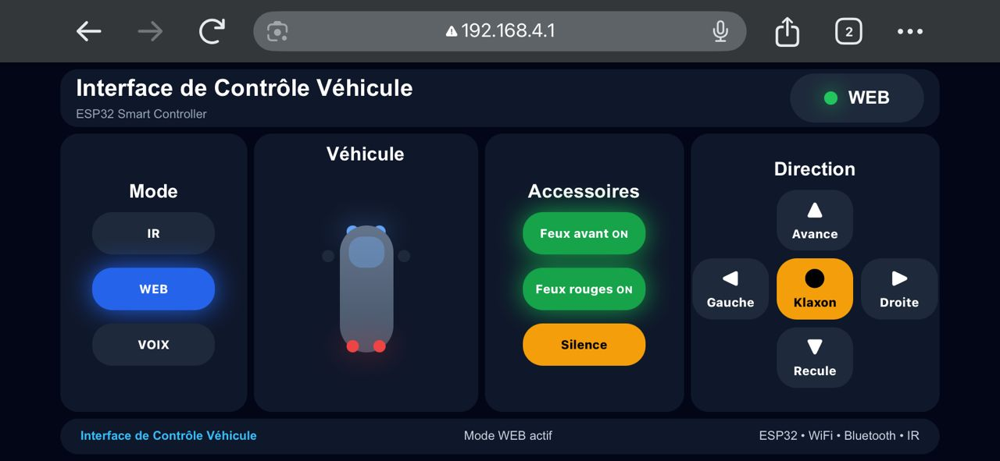

# Interface de Contrôle Véhicule ESP32

Projet de véhicule intelligent contrôlé avec un ESP32.

## Aperçu de l’application web



## Fonctionnalités

- Contrôle par télécommande IR
- Contrôle par application web WiFi
- Mode commande vocale via Bluetooth
- Sélection d’un seul mode actif à la fois :
  - IR
  - Web
  - Voice
- Détection d’obstacles avant et arrière
- Arrêt automatique en cas de danger
- Klaxon
- Feux avant
- Feux rouges arrière
- Clignotants gauche et droite
- Interface web responsive pour téléphone en mode paysage

## Technologies utilisées

- ESP32
- Arduino IDE
- SPIFFS
- WiFi Access Point
- WebServer ESP32
- IRremote
- Bluetooth
- HTML
- CSS
- JavaScript

## Structure du projet

```text
vehicule/
├── vehicule.ino
├── README.md
├── 1.jpeg
└── data/
    ├── index.html
    ├── style.css
    └── app.js
